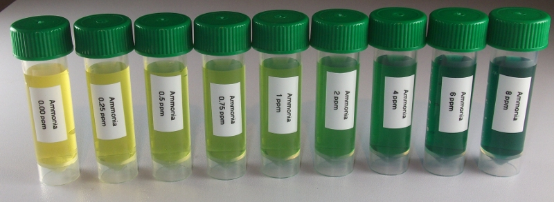

API ammonia test kit
========================

Reagents & Equipment
----------------------------

* Colorimeter
* Cuvettes
* 5 mL sample bottles or other capped tubes
* API ammonia test kit
* (Optional) Distilled water for sample dilutions

Colorimeter set-up
------------------------

* Wavelength: 625 nm. Red led (colorimeter RGB board) 
* Ammonia standard data: download a data file or prepare your own nitrate standard data
* Before measuring blank the colorimeter against water or a distilled water sample developed with API reagent as described below

Method
---------

* Fill an empty sample bottle to the 5 mL line with your water sample.
* Add 8 drops of API Ammonia Test Solution, Bottle #1. 
* Cap the bottle and invert to mix the solutions.
* Add 8 drops of API Ammonia Test Solution, Bottle # 2. 
* Cap the bottle and shake thoroughly to mix. 
* Wait 5-10 mins for the color to fully develop.
* Pour some of the sample into a cuvette, place in the colorimeter and click measure. The program will return the ammonia concentration in ppm.
 
 
 