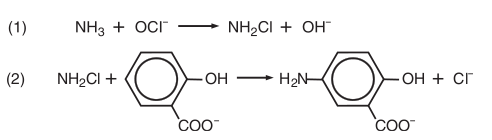

.. Measure ammonia with the colorimeter documentation master file, created by
   sphinx-quickstart on Thu May 22 19:12:58 2014.
   You can adapt this file completely to your liking, but it should at least
   contain the root `toctree` directive.

Introduction
===============================================

Ammonia in water is commonly measured by the salicylate colorimetric assay. In this assay, the first reaction step involves the conversion of ammonia to monochloroamine by the addition of chlorine. The monochloroamine then reacts with salicylate to form 5-aminosalicylate.  
Finally, the 5-aminosalicylate is oxidized in the presence of sodium nitroferricyanide (a catalyst) to form a blue-green colored dye that absorbs light at 650nm. 

We have so far tested two salicylate methods for measuring ammonia levels in water samples with the colorimeter:

#. **Salicylate test - make your own reagents**  
#. **API test kit - commercial kit, reagents supplied** 

Of these two methods tested so far, the API test kit is more convenient for at-home use although we do also like to use the salicylate test as well. Really depends on which is most convenient, and in most cases the API test kit works fine.

Table of Contents
=========================

Methods 
^^^^^^^^^^^^

.. toctree::
   :maxdepth: 1

   salicylate.rst
   api.rst

   
Ammonia calibration data
^^^^^^^^^^^^^^^^^^^^^^^^^^^^^^^

.. toctree::
   :maxdepth: 1

   ammonia_calibration.rst
   calibration_data.rst

   
   
   
Notes
^^^^^^^^^^^^^^^^^^^^^^^^^^^^^^^

.. toctree::
   :maxdepth: 1

   notes.rst

Search
-------------------

* :ref:`search`

